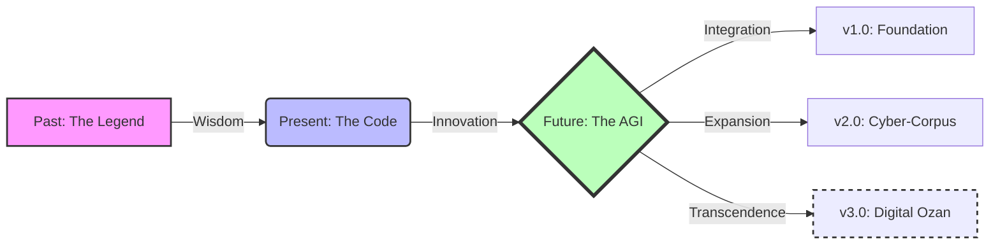

# 🌌 DedeKorkutNLP: Geçmişin Hikmeti, Geleceğin Zekası


<div align="center">

[](LICENSE)
[](https://www.python.org/)
[](https://github.com/bahattinyunus/DedeKorkutNLP)
[](CONTRIBUTING.md)

</div>

---

<div align="center">
  <h3>
    <a href="MANIFESTO.md">📜 Okuyun: DedeKorkutNLP Manifestosu</a>
  </h3>
  <p><em>"Bir yapay zeka sadece metin üretmez; kültürün kodlarını geleceğe taşır."</em></p>
</div>

---

## � Vizyon (The Vision)

**DedeKorkutNLP**, sıradan bir doğal dil işleme kütüphanesi değildir. O, Türkçenin derin, karmaşık ve şiirsel yapısını dijital çağa taşıyan bir **"Bilge Ajan"**dır (Sage Agent).

Bin yıl önce Dede Korkut, kopuzuyla Oğuz boylarının hikayelerini anlatırdı. Bugün, DedeKorkutNLP algoritmalarıyla veriden hikmet süzüyor.

**Misyonumuz:**
> Türkçe NLP çalışmalarını "tak-çalıştır" kolaylığına indirgemek değil, ona bir **ruh** katmaktır.

---

## 🚀 Özellikler (Features)

| Özellik | Açıklama |
| :--- | :--- |
| **🛡️ Linguistic Fortress** | Türkçenin eklemeli yapısına (agglutinative) uygun, kaya gibi sağlam tokenizasyon ve kök bulma. |
| **⚡ Cyber-Speed Metrics** | ROUGE, BLEU, WER ve CER hesaplamalarında optimize edilmiş hız. |
| **🧠 Wisdom Engine** | Modern LLM'ler (GPT, Llama) ile entegre çalışabilen "Prompt Mühendisliği" şablonları. |
| **📜 Digital Corpus** | (Yakında) Temizlenmiş, etiketlenmiş ve analize hazır devasa Türkçe veri setleri. |

---

## � Kurulum (Installation)

Geleceğe bir adım atın:

```bash
git clone https://github.com/bahattinyunus/DedeKorkutNLP.git
cd DedeKorkutNLP
pip install .
```

---

## ⚡ Hızlı Başlangıç (Quick Start)

### Bir Hikaye Başlatın

```python
from dedekorkut import DedeKorkut

# Bilgeyi Çağır
dk = DedeKorkut()

# Metni İşle (The Rite of Preprocessing)
text = "Gelecek, köklerine bağlı olanların elinde yükselecektir."
processed = dk.preprocess(text, mode="deep_clean")

print(f"🔮 Arınmış Metin: {processed}")
```

### Hikmeti Ölçün (Evaluation)

```python
from dedekorkut.metrics import calculate_wisdom_score

reference = "Yapay zeka insanlığın hizmetindedir."
hypothesis = "Yapay zeka insanlara yardım eder."

score = calculate_wisdom_score(reference, hypothesis)
print(f"✨ Bilgelik Skoru (Semantic Similarity): {score}")
```

---

## �️ Yol Haritası (Roadmap)



---

## 🤝 Katkıda Bulunma (Contribution)

Biz kod yazmıyoruz, **tarih yazıyoruz**.

Eğer bu destana bir satır eklemek isterseniz, [CONTRIBUTING.md](CONTRIBUTING.md) dosyasındaki "Onur Yasası"nı (Code of Honor) okuyun.

### Akademik Atıf
Bu kütüphaneyi çalışmalarınızda kullanırsanız, lütfen atıf yapın: [CITATION.cff](CITATION.cff)

---

<div align="center">

**[GitHub](https://github.com/bahattinyunus) • [LinkedIn](#) • [Documentation](#)**

*"Yerli ve Milli NLP'nin Sesi"*

</div>
